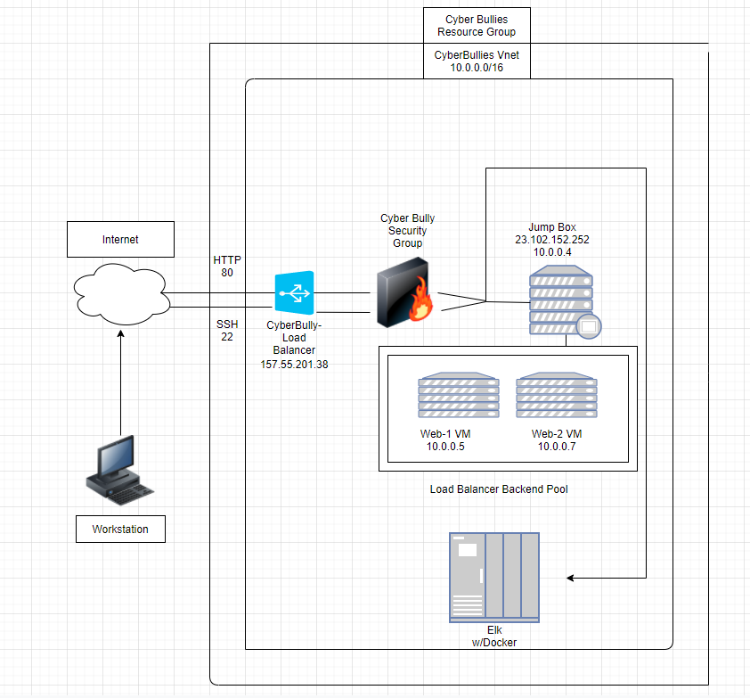

## Elk-Stack Project 1

The following diagram shows a visual picture of our Elk Stack project.

These files have been tested and used to generate a live ELK deployment on Azure. They can be used to either recreate the entire deployment pictured above. Alternatively, select portions of the roles file may be used to install only certain pieces of it, such as Filebeat.

Playbook file: under the containers root access /etc/ansible/elk.yml

This document contains the following details:
- Description of the Topologu
- Access Policies
- ELK Configuration
  - Beats in Use
  - Machines Being Monitored
- How to Use the Ansible Build

### Description of the Topology

The main purpose of this network is to expose a load-balanced and monitored instance of DVWA, the D*mn Vulnerable Web Application.

Load balancing ensures that the application will be highly reliable, in addition to restricting traffic to the network.
- _Load balancing ensures that the application will be highly reliable in addition to restricting traffic to the network.
  Load balancers are good to defend against denial-of-service (DDos) attacks.
  Jump box helps organizations to establish a clear funnel through which traffic must pass through to be able to traverse to other servers.

Integrating an ELK server allows users to easily monitor the vulnerable VMs for changes to the logs and system traffic.
- _  Filebeat is a logging agent installed on the machine generating log files or locations that you specify.
- _  Metricbeat collects metrics from your systems and services running on the server.

The configuration details of each machine may be found below.

| Name     | Function | IP Address | Operating System |
|----------|----------|------------|------------------|
| Jump Box | Gateway  | 10.0.0.4   | Linux            |
| Web-1    | WebServer| 10.0.0.5   | Linux            |
| Web-2    | WebServer| 10.0.0.7   | Linux            |

### Access Policies

The machines on the internal network are not exposed to the public Internet. 

Only the Jump Box machine can accept connections from the Internet. Access to this machine is only allowed from the following IP addresses:
- _23.102.152.252

Machines within the network can only be accessed by Jump Box virtual machine.
- _Which machine did you allow to access your ELK VM? What was its IP address?_
- _Public IP address from home

A summary of the access policies in place can be found in the table below.

| Name     | Publicly Accessible | Allowed IP Addresses |
|----------|---------------------|----------------------|
| Jump Box | Yes                 | Home IP Address      |
| Web-1    | No                  | 10.0.0.4             |
| Web-2    | No                  | 10.0.0.4             |

### Elk Configuration

Ansible was used to automate configuration of the ELK machine. No configuration was performed manually, which is advantageous because it saves the admin time with their daily tasks.

The playbook implements the following tasks:
- _TODO: In 3-5 bullets, explain the steps of the ELK installation play. E.g., install Docker; download image; etc._
- ...I installed docker.io as well as python-pip and docker.
- ...Ran the command systctl -w vm.max_map_count=262144
- ...Ended with launching the docker container elk.

The following screenshot displays the result of running `docker ps` after successfully configuring the ELK instance.

**Note**: The following image link needs to be updated. Replace `docker_ps_output.png` with the name of your screenshot image file.  

### Target Machines & Beats
This ELK server is configured to monitor the following machines:
- _Web-1 10.0.0.5
- _Web-2 10.0.0.7

We have installed the following Beat on these machines:
- _Filebeat

These Beats allow us to collect the following information from each machine:
- _TODO: In 1-2 sentences, explain what kind of data each beat collects, and provide 1 example of what you expect to see. E.g., `Winlogbeat` collects Windows logs, which we use to track user logon events, etc._

### Using the Playbook
In order to use the playbook, you will need to have an Ansible control node already configured. Assuming you have such a control node provisioned: 

SSH into the control node and follow the steps below:
- Copy the _____ file to _____.
- Update the _____ file to include...
- Run the playbook, and navigate to ____ to check that the installation worked as expected.

_TODO: Answer the following questions to fill in the blanks:_
- _Which file is the playbook? Where do you copy it?_
- _Which file do you update to make Ansible run the playbook on a specific machine? How do I specify which machine to install the ELK server on versus which to install Filebeat on?_
- _Which URL do you navigate to in order to check that the ELK server is running?

_As a **Bonus**, provide the specific commands the user will need to run to download the playbook, update the files, etc._
